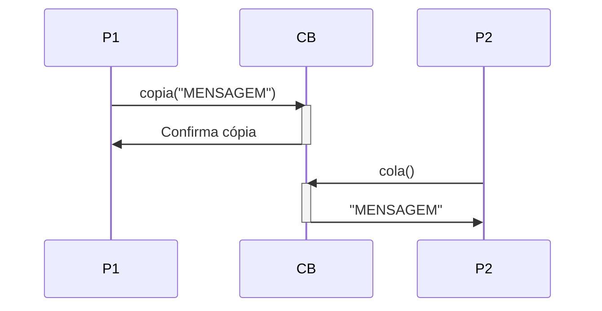

# CTRL+C; CTRL-V

## Introdução

Você já pensou em como funciona o copiar colar ou Ctrl+C, Ctrl+V? 

Pois bem, ele funciona mais ou menos assim:

- Ctrl+C: Um conteúdo é copiado de uma aplicação (P1) para a área de transferência (CB);
- Ctrl+V: O conteúdo é transferido da área de transferência (CB) para outra aplicação (P2).

Seja:
- `P1` o processo 1;
- `P2` o processo 2; 
- `CB` o processo que representa a área de transferência (*Clipboard*, em inglês) e que possui uma caixa de mensagens;
- `A -> B: fn(args)`
 
  A notação que indica que o processo `A` enviou mensagem para o processo `B` executar a função `fn` com os argumentos `args`.

Assim, o processo de copiar colar seria representado por:

1. P1 -> CB: `copiar("MENSAGEM")`
2. CB -> P1: Confirma cópia
3. P2 -> CB: `colar()`
4. CB -> P2: `"MENSAGEM"`

O seguinte diagrama de sequência ilustra os passos descritos anteriormente.


## Implementação em Python

Material necessário:

- Python instalado
- Módulo *pyperclip* instalado: 
  
  `pip3 install pyperclip`

Estude e execute o código [copiacola.py](./copiacola.py)

O código segue abaixo para facilitar seu estudo:

```python
import pyperclip as clipboard

# Copiar ou Ctrl+C
texto = input('Digite o texto a copiar: ')
clipboard.copy(texto)
print("Seu texto foi copiado para área de transferência.")

# Colar ou Ctrl+V
print("Copie um texto de outra aplicação e")
input('pressione ENTER para recuperá-lo da área de transferência.')

texto = clipboard.paste()
print("Texto colado:", texto)

input("Pressione ENTER para sair.")
```
